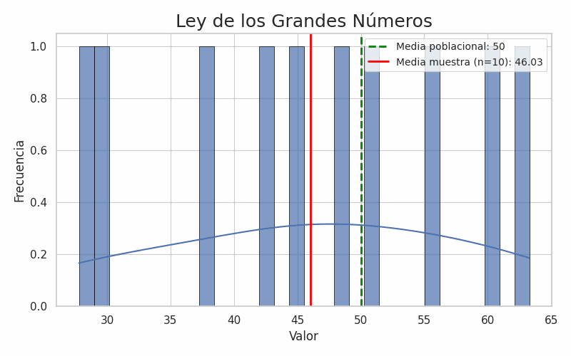

# 📊✨ La Ley de los Grandes Números: la base silenciosa de la confiabilidad en Ciencia de Datos 📊✨

¿Te has preguntado por qué las conclusiones basadas en muchos datos suelen ser más confiables? La respuesta está en un principio estadístico fundamental: **La Ley de los Grandes Números (LGN).**

🔍 **¿Qué dice esta ley?**  
A medida que se incrementa el tamaño de una muestra aleatoria, su media se acerca a la media real de la población.  
Esto significa que, aunque en muestras pequeñas los resultados pueden variar mucho, al aumentar el número de observaciones, la variabilidad disminuye y las estimaciones se estabilizan alrededor del valor verdadero.

📌 **Existen dos formas de esta ley:**  
- ✅ **Forma débil:** garantiza que la media muestral se aproxima al valor esperado en probabilidad a medida que *n* crece.  
- ✅ **Forma fuerte:** asegura que esta convergencia ocurre casi con certeza cuando el tamaño de muestra tiende a infinito.  

Ambas son fundamentales para justificar que los promedios y resultados basados en muestras grandes son confiables en estadística y ciencia de datos.

📌 **¿Dónde la aplicamos?**  
- ✅ Estadística: para reducir error muestral.  
- ✅ Análisis de Datos: en encuestas, A/B testing y mediciones de desempeño.  
- ✅ Ciencia de Datos: para entrenar y validar modelos predictivos robustos.

📊 **Aplicaciones prácticas:**  
- 📈 Estimar la tasa de satisfacción de clientes.  
- 📉 Validar un modelo de clasificación.  
- 🧪 Medir el impacto de una campaña publicitaria, etc.

📌 **En resumen:**  
La Ley de los Grandes Números nos recuerda que los datos cuentan, pero contar con suficientes datos cuenta aún más. 📊

✨ **Ahora te leo a ti:**  
👉 ¿Ya aplicabas este concepto sin saberlo?  
👉 ¿Te ha tocado lidiar con resultados poco confiables por muestras pequeñas?  

Cuéntamelo en los comentarios 👇 o comparte este post con alguien que esté iniciando en datos. ¡Hagamos que más personas aprendan ciencia de datos de forma clara y aplicada! 📊💡

---

## 📸 GIF animado

---

## 📜 Código fuente para generar el GIF

Si quieres ver cómo creé la animación que acompaña este post, puedes consultar el código completo aquí:  
[➡️ Ver código en Python](code/ley_grandes_numeros_gif.py )

---

## 🔗 Publicación original en LinkedIn

[👉 Ver post en LinkedIn](https://www.linkedin.com/posts/gladys-choque-ulloa_datascience-estadaedstica-leydelosgrandesnaeqmeros-activity-7340740111912869889-rW2J?utm_source=share&utm_medium=member_desktop&rcm=ACoAADI1mqUBb0hc4pScJdT4pg83Ceog9nc061E)

---

#DataScience #Estadística #LeyDeLosGrandesNúmeros #AnálisisDeDatos #MachineLearning #CienciaDeDatosParaTodos #DatosConGladys

*Publicado originalmente en LinkedIn el 20 de junio de 2025*  

