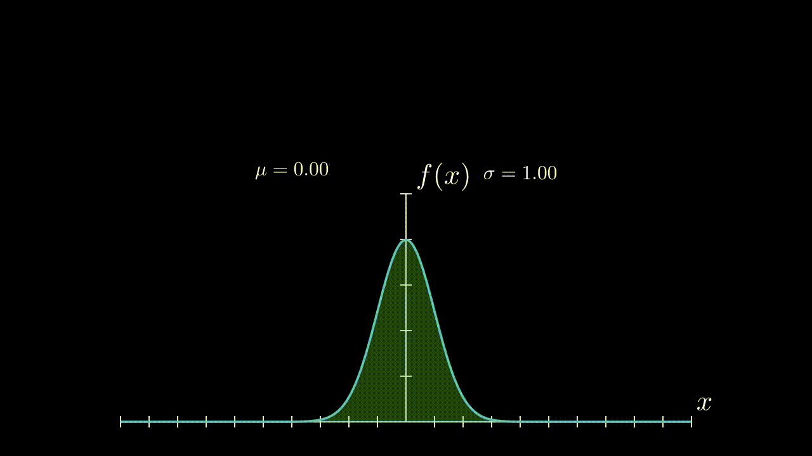

# 🎥✨ Mi Primera Animación Matemática con Manim ✨🎥

Hoy me animé a explorar **Manim (Mathematical Animation Engine)**, una poderosa herramienta de Python para crear animaciones matemáticas de forma programática. 📊💻

Utilicé el entorno interactivo de **Binder** para ejecutar el notebook sin necesidad de instalar nada en mi equipo, y este fue el resultado de mi primer gráfico animado.  
Sé que aún no está tan bonito como me gustaría, pero vamos aprendiendo poco a poco… ¡y eso también se disfruta! 😆 😁

## 📽️ Animación: Distribución Normal con Manim

Aquí te comparto mi primera animación creada con Manim, representando una **distribución normal** 📊✨

## 📌 Recursos

- 📂 Puedes revisar y probar el notebook desde el repositorio oficial aquí:  
  👉 [Repositorio en GitHub](https://lnkd.in/emHAt4x2)

- 🚀 Correrlo online sin instalar nada desde Binder:  
  👉 [Abrir en Binder](https://lnkd.in/e3SgUDhW)

## 📌 ¿Qué es Manim?

**Manim** es una librería open-source de Python desarrollada inicialmente por **Grant Sanderson (3Blue1Brown)** para crear animaciones matemáticas didácticas y visualmente impactantes.  

Ideal para quienes amamos **Data Science**, **Estadística** y **Visualización de Datos** 📊✨.

## 🔍 Lo que más me gustó:

✅ Control total del contenido visual mediante código.  
✅ Integración perfecta con Jupyter Notebooks.  
✅ Posibilidades infinitas para animar conceptos matemáticos complejos.

## 📣 ¡Cuéntame en los comentarios!

👉 Si te gustaría que prepare un tutorial paso a paso para instalarlo o utilizarlo desde Binder, **¡déjamelo saber!** 📩✨  

Y si ya has trabajado con Manim, me encantaría conocer tu experiencia y qué tipo de animaciones has creado. ¡Compártelo con nosotros! 👩‍💻🎨

## 📊 Hashtags

`#DataScience` `#VisualizaciónDeDatos` `#Manim` `#Python` `#CienciaDeDatos` `#Estadística` `#DatosConGladys`

---

Gladys 👩‍💻✨
