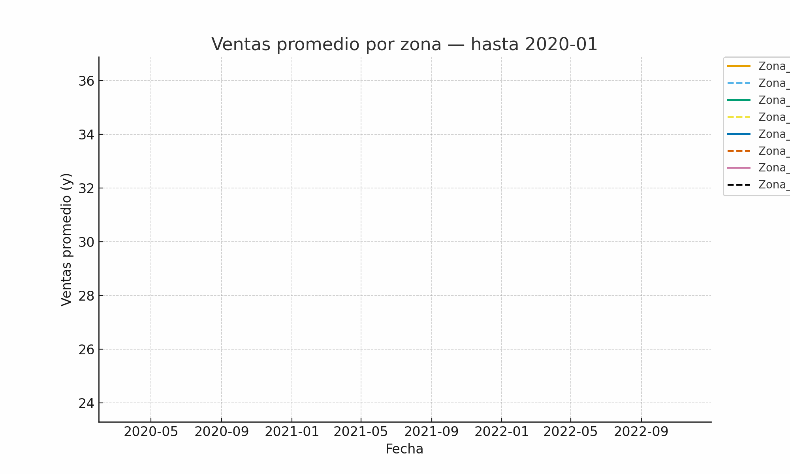

# Datos de Panel: Cómo entender el cambio y las diferencias a la vez 📊

Cuando analizamos datos que cambian en el tiempo y entre unidades, surge una pregunta clave:  
**¿Cómo capturar las diferencias individuales y las tendencias temporales al mismo tiempo?** 🤔

Muchas veces, mirar solo un corte transversal de los datos o solo una serie temporal nos hace perder patrones importantes.  
Aquí es donde los **datos de panel** se vuelven fundamentales, porque combinan **información temporal y transversal**, permitiéndonos modelar cambios y heterogeneidad al mismo tiempo.

---

👉 Imagina que quieres entender cómo la temperatura afecta las ventas de yogurt en Lima, mes a mes y por zona.  
Si solo miras un mes, pierdes la historia completa; si solo miras una zona, no ves diferencias entre áreas.  
Los datos de panel resuelven este dilema.

---

## ✅ Conceptos Clave de Datos de Panel

- **Transversal:** múltiples unidades (personas, empresas, regiones…).  
- **Temporal:** observaciones repetidas en el tiempo.  
- **Efectos Fijos (FE):** controlan características individuales constantes.  
- **Efectos Aleatorios (RE):** asumen diferencias individuales aleatorias.  
- **Modelos Dinámicos:** incluyen variables rezagadas para estudiar persistencia temporal.  

### 🔧 Herramientas recomendadas
- **R:** `plm`, `lme4`, `panelr`  
- **Python:** `linearmodels`, `statsmodels`, `PyMC` / `Bambi`

---

## 🎬 Animación del Modelo

El repositorio incluye un **GIF animado** mostrando cómo evolucionan las ventas promedio por zona (observado vs predicho):

  

Esta visualización permite ver:

- Diferencias entre zonas.  
- Cómo las predicciones del modelo siguen los datos observados.  
- Patrones temporales y estacionales.

---

## 🚀 Buenas prácticas

- Visualizar los datos antes y después del modelado: líneas de tiempo, boxplots y comparaciones de predicciones.  
- Elegir correctamente entre **efectos fijos y aleatorios** según la estructura de tus datos.  
- Documentar los supuestos del modelo y validar las predicciones.

---

## 📚 Recursos para profundizar

- Wooldridge, J. M. *Econometric Analysis of Cross Section and Panel Data.* MIT Press  
- Baltagi, B. *Econometric Analysis of Panel Data.* Springer  
- Cameron, A. C. & Trivedi, P. K. *Microeconometrics: Methods and Applications.* Cambridge University Press  
- Croissant, Y., & Millo, G. *Panel Data Econometrics with R.* Wiley

---

✍️ Si este contenido te resultó útil, compártelo con tu comunidad.  
▶️ Sígueme para más contenido de datos: 🔗 Datos con Gladys: https://linktr.ee/gladyschoqueulloa 

#DataScience #PanelData #Statistics #MachineLearning #DatosConGladys

