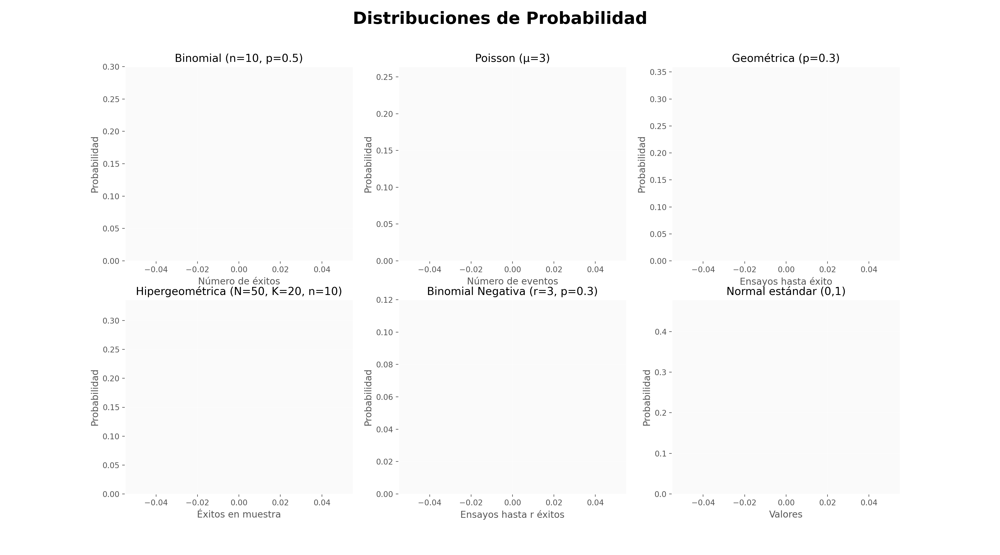

# 🎯 ¿𝗤𝘂𝗲́ 𝗲𝘀 𝘂𝗻𝗮 𝗱𝗶𝘀𝘁𝗿𝗶𝗯𝘂𝗰𝗶𝗼́𝗻 𝗱𝗲 𝗽𝗿𝗼𝗯𝗮𝗯𝗶𝗹𝗶𝗱𝗮𝗱 𝘆 𝗽𝗼𝗿 𝗾𝘂𝗲́ 𝗲𝘀 𝘁𝗮𝗻 𝗶𝗺𝗽𝗼𝗿𝘁𝗮𝗻𝘁𝗲 𝗲𝗻 𝗘𝘀𝘁𝗮𝗱𝗶́𝘀𝘁𝗶𝗰𝗮 𝘆 𝗖𝗶𝗲𝗻𝗰𝗶𝗮 𝗱𝗲 𝗗𝗮𝘁𝗼𝘀?

Una *distribución de probabilidad* es una herramienta matemática que describe cómo se comporta una *variable aleatoria*.  
En otras palabras, nos indica *qué tan probable es que un determinado valor ocurra* dentro del conjunto de todos los posibles valores.

---

## 🔍 Por ejemplo:

Si lanzamos un dado, sabemos que cada número del 1 al 6 tiene la *misma probabilidad* de salir.  
Esa es una *distribución uniforme discreta*.

Pero, ¿qué pasa con el *tiempo que tarda un paciente en ser atendido, o el **número de defectos por lote en una fábrica*?  
Aquí hablamos de otras distribuciones más complejas que modelan ese tipo de comportamientos.

---

## 📌 ¿Por qué son tan importantes?

✔ *Comprender el comportamiento de los datos*:  
Antes de aplicar cualquier modelo, debemos saber cómo se distribuyen los datos para tomar decisiones acertadas.

✔ *Seleccionar técnicas estadísticas adecuadas*:  
Muchas pruebas estadísticas y modelos de Machine Learning asumen ciertas distribuciones.  
Usar una técnica sin verificar estas condiciones puede llevar a *resultados erróneos*.

✔ *Predecir eventos y reducir la incertidumbre*:  
En ciencia de datos, modelamos el futuro basándonos en datos pasados.  
Las distribuciones nos permiten *estimar probabilidades de eventos y riesgos*.

✔ *Fundamento de la inferencia estadística*:  
Pruebas de hipótesis, intervalos de confianza y modelos bayesianos se basan en distribuciones.

---

## 📊 Tipos de distribuciones de probabilidad

### 🔹 Distribuciones Discretas:

- *Binomial*: modela el número de éxitos en una serie de ensayos (como lanzar una moneda varias veces).
- *Poisson*: eventos raros en un tiempo o espacio determinado (como llamadas a un call center).
- *Geométrica*: número de intentos hasta el primer éxito.

### 🔹 Distribuciones Continuas:

- *Normal*: famosa "curva de campana", modela muchos fenómenos naturales.
- *Exponencial*: tiempo entre eventos (como fallas en un sistema).
- *Uniforme continua*: todos los valores dentro de un rango tienen la misma probabilidad.
- *Distribuciones derivadas de la Normal*: 
  - *Chi-cuadrado, **t-student, **F*: esenciales para pruebas estadísticas e inferencias.

---


## ⚠ Observación

Además de las distribuciones mencionadas, existe una *gran variedad de otras distribuciones específicas y especializadas*, cada una adaptada para modelar fenómenos particulares en distintos campos.

> Por eso, conocerlas y elegir la adecuada es *clave para un análisis efectivo y confiable*.

---

## 💬 En resumen

Una *distribución de probabilidad* es la base para entender la *incertidumbre*.  
Es el primer paso para cualquier análisis estadístico serio y una piedra angular en la Ciencia de Datos.

---

📣 *¿Qué distribución usas más en tus proyectos?*  
¿Tienes alguna favorita o alguna que te haya sorprendido?  
¡Te leo en los comentarios! 👇

---

#Estadística #CienciaDeDatos #DistribuciónDeProbabilidad #MachineLearning #DatosConGladys

## BONUS: Si te preguntas, ¿Cómo realizó el GIF animado?, aquí te dejo los pasos y la documentación.

1. Cópia este repositorio.
2. Instala las dependencias: pip install matplotlib numpy
3. Ejecuta el script:  
```bash
python code/animacion_distribuciones.py
