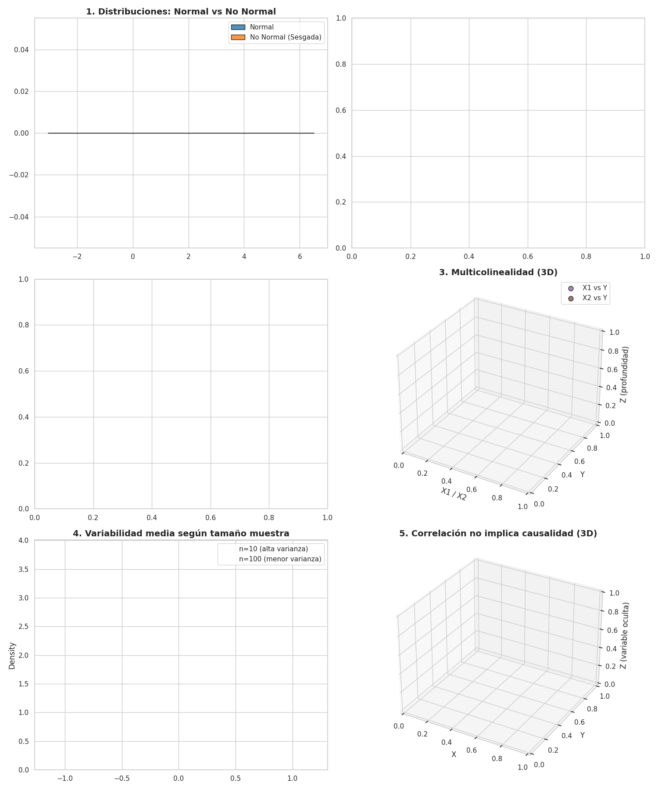

# 🎯 Errores Comunes en un Análisis Estadístico: Claves para Evitarlos y Mejorar la Calidad de tus Resultados

La estadística es el lenguaje de los datos, pero un mal análisis puede transformar insights valiosos en decisiones erróneas. 🚫📊

A lo largo de mi experiencia creando contenido en **"Datos Con Gladys"**, he identificado patrones de errores que afectan desde proyectos académicos hasta iniciativas en la industria.

---

## 🎥 Visualización de Errores Comunes en Análisis Estadístico

A continuación te comparto una animación donde podrás visualizar de forma interactiva 6 errores comunes en análisis estadístico:

📊 Esta animación fue creada en Python utilizando **Matplotlib** y **Seaborn**, y muestra en tiempo real cómo estos errores afectan la interpretación de los datos.

---

## 👉 6 Errores Comunes en Análisis Estadístico

### 🔍 1. Asumir normalidad sin verificarlo
No, no todos los datos son normales. Antes de aplicar pruebas t, ANOVA o modelos paramétricos, asegúrate de validar esta suposición con pruebas como **Shapiro-Wilk** o explorando histogramas y QQ-plots.

### 📏 2. Ignorar la homogeneidad de varianzas
Comparar grupos sin verificar si sus varianzas son iguales puede inflar errores tipo I/II.  
**Prueba de Levene** o **Bartlett** son esenciales para diagnosticar esta condición.  
Si detectas heterocedasticidad, recurre a métodos robustos o no paramétricos.

### 📊 3. Interpretar coeficientes sin contexto
Los coeficientes no se interpretan solos.  
Considera siempre:
- Las unidades de medida
- La escala de las variables
- La multicolinealidad existente

### 🧪 4. No considerar el tamaño de muestra y la potencia estadística
Si tu muestra es pequeña, podrías no detectar efectos reales.  
¡Nunca subestimes la importancia de planificar con cálculos de tamaño de muestra y potencia estadística!

### 🔗 5. Confundir correlación con causalidad
¡Cuidado! Correlación no implica causalidad.  
Para hablar de relaciones causales necesitas:
- Diseños experimentales adecuados
- Modelos de variables instrumentales
- Análisis longitudinales

### ⚠ 6. No tratar adecuadamente datos faltantes y outliers
Ignorar valores extremos o datos incompletos puede sesgar tus resultados.  
Aplica técnicas como:
- Imputación múltiple
- Análisis robustos

---

## 📚 Profundiza en el artículo completo:
👉 [Lee más en mi blog de Medium](https://medium.com/@gladyschoqueulloa20/́-́-bd45d5f7ae25)

---

## 🧑‍💻 Código Fuente de la Animación
El código completo para generar la animación lo puedes encontrar aquí:  
👉 [Ver Código en este Repositorio](code/codigo_animacion_errores_estadisticos.py)

---

## 💡 Reflexión
La estadística es poderosa, pero exige rigor.  
Estos errores son más comunes de lo que creemos, incluso a niveles avanzados.

Por eso, te invito a profundizar en estos temas y fortalecer juntos una cultura de análisis responsable. 🙌📈

---

## 🔽 Cuéntame en comentarios:
👉 ¿Qué otros errores has visto en proyectos de análisis estadístico?  
👉 ¿Te gustaría que profundice en alguno de estos puntos en un próximo post?

---

### ✍️ Gladys Choque Ulloa
Data Scientist | Ph(c). |Divulgadora | Fundadora de Women in DataLab
Sígueme en Redes Sociales: https://linktr.ee/gladyschoqueulloa

---

#DataScience #Estadística #AnálisisDeDatos #MachineLearning #DataAnalytics #CienciaDeDatos #AprenderEstadística #DatosConGladys
